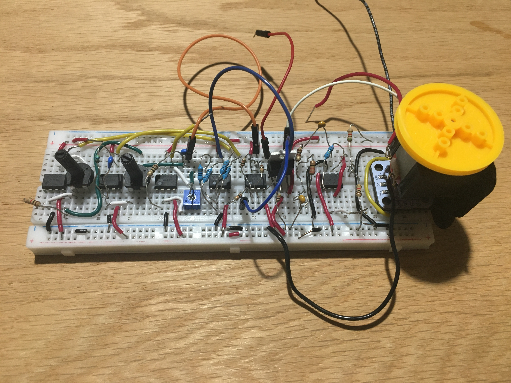

# Analog PI Control for Basic Positioning of a Brushed DC Motor

## Video Demo
https://github.com/user-attachments/assets/2bba8920-0b15-401e-9de0-5b88466c60b8

If the video does not play, refresh the page.

## Project Overview and Goals
This is a project I completed at the beginning of Summer 2025. Essentially it turns a brushed DC motor into a servo motor, though it cannot produce the torque of one. Given an input voltage in the range of 0V-5V, it positions the motor to an angle proportional to the input voltage. For example, 0V would position the motor at 0 degrees while 2.5V would position the motor at 180 degrees. The controller is built with op-amps and an encoder. Initially, I wanted to create a PID controller, but the signals from the derivative term were often too noisy. As a result, I ended up with a PI controller. Nevertheless, a PI controller is more than sufficient to control the position of the motor.

## Design
There were two design constraints that I set for this project. The first design constraint was that I could only use parts I already had on hand. The second design constraint was that only one breadboard can be used to place the circuit components onto.

### Preliminary Design
The first step taken in the design phase was to plan how the overall structure of the system should be to accomplish the control task. The overall system requires three components: an actuator, a sensor, and a PI Controller. The sensor's task is to determine the angular position of the motor, which the PI controller will use to correct the position of the motor. Below is a block diagram of the preliminary design.  

### Detailed Design
After the components of the system have been identified, the next step is to create the actual designs of each component.

**Motor:** 
For the motor, a simple brushed DC motor was chosen.

**Sensor:** 
For the sensor, the [AS5600](https://www.amazon.com/Alinan-Magnetic-Precision-Induction-Measurement/dp/B09QYC916Q/ref=sr_1_2?crid=10C8NZ1YKT58R&dib=eyJ2IjoiMSJ9.YZizyEOTJGdbWMdPyBu7o0Rsgd5HjGFnRmtuEtfNnTljZU2HDIb_qJHsKHY61s5aMJdgfYZDIkEsN42gs8_CnGSUyDTQqBMotRdeNM5-_zAMgwryovnfxBT9yb-pNjNNEOc5btz3pYnLyYbaVYAvhSkmo6feZbrukfaQPE2SgXuQBE8JOJYh0L0BHkv5HGoIkqm0uv37NATq2lWsFA_mzvEMylc6sG_na-si5Z0ITJv86VFmTe8Va372K2oxmTsWeTiLc3htj0PrdWqDzqQNdm6ix550WeKt2WwUMZ3U1mM.vcYIYn2YM61Io9tWeZkQeQxN3XXNtuLz-NYIQ3bRAY8&dib_tag=se&keywords=as+5600+motor+encoder&qid=1745478629&s=industrial&sprefix=as+5600+motor+encode%2Cindustrial%2C93&sr=1-2#averageCustomerReviewsAnchor) magnetic encoder breakout board was chosen. The key reason this sensor was chosen is that it outputs a voltage proportional to the angular position. Most other encoders send pulses that are difficult to process without a microprocessor. There are many ways to wire and configure this device, but I won't go into it here since only the output of this "blackbox" is relevant for the project. However, you are curious, [here](https://www.youtube.com/watch?v=_BwtM5f6AQ0) is how I did it (though it is far from the best way since it degrades the device quickly).

**PI Controller:** 
Designing the PI Controller was easily the most difficult part of this project. The approach that I used was to break the PI Controller down into its sub-components and test each individually. In total I identified 5 sub-components as I progressed through the PI controller:

1. Subtraction op-amp circuit
2. Proportional op-amp circuit
3. Lossy Integrator op-amp circuit
    * Why am I using a lossy integrator opposed to a pure integrator? The reason is because if the output of the encoder has very low frequency, the output of the pure integrator could grow very fast. With DC input signals, the pure integrator output will ramp unboundedly. The lossy integrator is a lowpass filter that levels off the gain as super low frequencies are approached. For example, every input signal below 31.8 Hz will be amplified by roughly the same amount of gain if the cutoff frequency is 31.8 Hz.
4. Summing op-amp circuit
5. Buffer to drive DC motor
    * Since the only op-amp I have used for all of the circuits up to this point is the [UA741CP](https://www.ti.com/lit/ds/symlink/ua741.pdf?HQS=dis-dk-null-digikeymode-dsf-pf-null-wwe&ts=1756429260439&ref_url=https%253A%252F%252Fwww.ti.com%252Fgeneral%252Fdocs%252Fsuppproductinfo.tsp%253FdistId%253D10%2526gotoUrl%253Dhttps%253A%252F%252Fwww.ti.com%252Flit%252Fgpn%252Fua741), there is nothing that has the capability to drive the brushed DC motor. While the UA741CP op-amp can supply a maximum of 40 uA of current, the motor will need much more. The [TDA2030A](https://www.st.com/resource/en/datasheet/cd00000129.pdf) is able to supply up to 3.5A. This is enough current for this motor, but there must be caution for current spikes. The output current of the TDA2030A is internally limited, which will help prevent the op-amp from blowing up.
    
Before I finalized my component values for each op-amp configuration, I ran simulations using LTspice to ensure that the circuits behaved desireably. Then, I created a model in simulink to ensure that I can correctly integrate each component together. Below is my Simulink block diagram.
  
Now that I determined that the system can be integrated properly, I designed a circuit by selecting passive component values and creating a schematic in Kicad. Below is a schematic of the final circuit.

## Results and Takeaways
In the end, I basically ended up with a servo motor. The system did behave how I desired, but I know that there are not many use cases for it besides educational purposes since the controller is quite heavy while the motor produces very little torque. Other brushed DC motors can be substituted easily, which is a perk of my controller.

I found the control problem to be quite easy. Unlike a drone or a self-balancing robot, this system is not inherently instable. As a result, there is not much tuning required to get a minimally functional system. On the other hand, the circuitry was quite a challenge. There were tons of roadblocks when it came to signal integrity. There were many things creating undesirable noise in my system, making it not work at all. Small things such as having a mouse wire near my system would generate a lot of noise, and I had to use my oscilloscope on multiple occassions to finally get my system working. As a result, I decided that my next few projects would be based on microcontrollers since it is much easier to create reliable systems that are based on microcontrollers.
